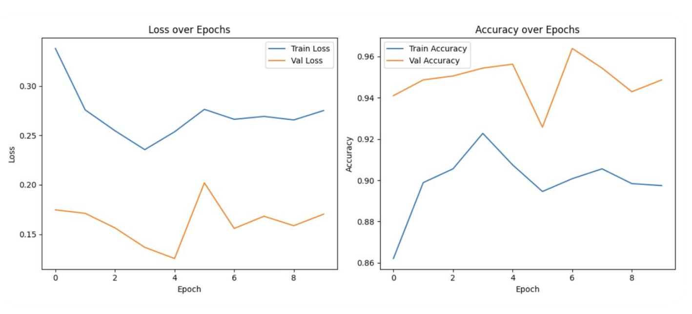

<header class="social-icons">
  
  
  
</header>

## 🤠 About Me

Hi! My name is Cyrus Navasca and I'm going into my fourth-year at UC Santa Barbara 
studying Statistics, Data Science and Math.

I am proficient in Python, R, SQL and Tableau among other languages with experience in
predictive modeling, data analysis and agentic AI. I currently work as a Data
Science & AI Intern at a fast-paced B2B startup at the intersection of AI agents
and machine learning.

Through various internships and technical experiences, I have grown into a confident problem-solver, an effective collaborator, and a quick adapter in fast-paced settings.
Outside of work, I love watching football (go Niners!), playing card games and
trying new coffee shops. 

I can be reached at [cyrusnavasca@ucsb.edu](mailto:cyrusnavasca@ucsb.edu), feel 
free to reach out and I am excited to hear from you all!

## 📝 Resume
<a href="Cyrus Navasca Resume August 2025.docx.pdf" download="Cyrus Navasca Resume August 2025.docx.pdf" 
   style="text-decoration: none;">
    <button style="background-color: #0073e6; color: white; border: none; padding: 12px 20px; 
                  font-size: 16px; border-radius: 8px; cursor: pointer; 
                  transition: 0.3s;">
        Download My Resume
    </button>
</a>

{width=75% height=600px}

## 📚 Education 
University of California, Santa Barbara | Santa Barbara, CA

B.S. in Statistics & Data Science, Minor in Mathematics 

3.63 GPA | Dean's Honor Roll

## 💼 Experiences

### Data Science & AI Intern @ Elas
As a Data Science & AI Intern so far, I have developed an AI agent that processes natural language queries to conduct predictive modeling and forecasting. I also designed a comprehensive PostgreSQL database schema with a flexible data model to support dynamic field storage, and implemented RESTful APIs to enable CRUD operations to support client sales workflows.

Working in a fast-paced but collaborative startup environment has strengthened my 
ability to ask meaningful questions, and adapt to new tools in order for me
contribute effectively to the team. Stay updated with the company's developments
at their website below!

<a href="https://elasapp.com/" target="_blank" style="text-decoration: none;">
    <button style="background-color: #0073e6; color: white; border: none; padding: 12px 20px; 
                  font-size: 16px; border-radius: 8px; cursor: pointer; transition: 0.3s;">
        Visit Elas
    </button>
</a>

     
### Data Analytics Research Asisstant @ META Lab
META Lab conducts experimental studies to examine the psychological effects of various states and conditions on traits such as curiosity and personality. I lead statistical analysis in the lab conducting A/B testing, mediation analysis and regressions. I am also responsible
for rigorous data preprocessing prepare raw data for analysis.

<a href="https://labs.psych.ucsb.edu/schooler/jonathan/" target="_blank" style="text-decoration: none;">
    <button style="background-color: #0073e6; color: white; border: none; padding: 12px 20px; 
                  font-size: 16px; border-radius: 8px; cursor: pointer; transition: 0.3s;">
        Visit META Lab
    </button>
</a>

### Data Analytics Intern @ Daily Nexus 
Daily Nexus is the official university newspaper for UC Santa Barbara. As a
Data Analytics Intern, I am responsible for collecting, cleaning and reporting
data. Specifically, my goal is to tell stories from messy data which are relevant
to my surrounding community.

Recently, I have completed my first piece at the Daily Nexus, which was an 
analysis on the relationship between Rate My Professors ratings and student GPAs
at UC Santa Barbara. To interact with my dashboard, click the button below!

<a href="https://dailynexus.com/2025-04-11/ucsb-students-receive-better-grades-in-courses-with-higher-rate-my-professors-ratings/" target="_blank" style="text-decoration: none;">
    <button style="background-color: #0073e6; color: white; border: none; padding: 12px 20px; font-size: 16px; border-radius: 8px; cursor: pointer; transition: 0.3s;" 
            onmouseover="this.style.backgroundColor='#005bb5';" 
            onmouseout="this.style.backgroundColor='#0073e6';">
        View Dashboard
    </button>
</a>

### President @ UCSB Data Science Collaborative
The UCSB Data Science Collaborative aims to make the field of data science 
accessible to new students and non-majors. During my time as President, I 
have mentored over 150 members and organized engaging networking events. I have
also taught workshops in topics such as data visualization, cleaning and 
machine learning, equipped with engaging presentation slides, and practice 
worksheets using sample datasets.

Being able to support new and ambitious students has been an extremely fulfilling
experience. Additionally, I have learned so much from by breaking complex
concepts into digestible pieces for members. This experience is one that has
both reinforced my technical expertise and enhanced my interpersonal skills. 
Our website can be found below where you can find club photos along with my 
workshop presentations and worksheets!

<a href="https://dscollab.github.io/" target="_blank" style="text-decoration: none;">
    <button style="background-color: #0073e6; color: white; border: none; padding: 12px 20px; 
                  font-size: 16px; border-radius: 8px; cursor: pointer; transition: 0.3s;">
        Visit UCSB Data Science Collaborative
    </button>
</a>

  
  

## 📊 Projects

### Detecting Diabetic Retinopathy w/ Computer Vision
For this project, my team and I trained a ResNet50 CNN to detect diabetic retinopathy, an eye disease that affects millions worldwide, from pateint retina scans. We implemented rigorous data augmentation and regularization to combat overfitting and achieved a 96% accuracy. Moreover, we integrated AWS S3 for efficient data storage and retrieval throughout the training pipeline.

Visit the project's repository below!

<a href="https://github.com/Shashin-Gupta/DSCollaborativeProject" target="_blank" style="text-decoration: none;">
    <button style="background-color: #0073e6; color: white; border: none; padding: 12px 20px; 
                  font-size: 16px; border-radius: 8px; cursor: pointer; transition: 0.3s;">
        Open Project GitHub
    </button>
</a>

  

  

### Predicting Credit Card Default with Neural Networks
In this project, I utilized PyTorch to construct a neural network which predicts
credit card default among clients. Using various statistical techniques, model 
performance was improved by 140%. The final model achieved a prediction accuracy
of 78% and performed well according to other evaluation metrics such as ROC-AUC
and precision/recall. 

The full project including code and visualizations can be found in the GitHub
repository below.

<a href="https://github.com/cyrusnavasca/cc-default-prediction/blob/main/Predicting_CC_Default_NN.ipynb" target="_blank" style="text-decoration: none;">
    <button style="background-color: #0073e6; color: white; border: none; padding: 12px 20px; 
                  font-size: 16px; border-radius: 8px; cursor: pointer; transition: 0.3s;">
        Open Project GitHub
    </button>
</a>

<figure style="display: flex; justify-content: space-between;">
  
    
    
</figure>

### Predictive Modeling of Heart Disease
In my introductory machine learning project, I implemented Random Forest and
Logistic Regression models to predict heart disease among patients. This was my
first dive into machine learning and taught me how to choose a model,
conduct basic exploratory data analysis, and evaluate models. 

<a href="https://github.com/cyrusnavasca/heart-disease-ml/blob/main/Heart_Disease_ML_Project.ipynb" style="text-decoration: none;">
    <button style="background-color: #0073e6; color: white; border: none; padding: 12px 20px; 
                  font-size: 16px; border-radius: 8px; cursor: pointer; transition: 0.3s;">
        Open Project GitHub
    </button>
</a>

  
  

  
  

### 2022 Diamond Price Analysis
For the following project, I implemented an in-depth regression analysis to examine
what factors had an effect on diamond prices in 2022. I 
conducted feature selection, polynomial transformation and identification of
unusual observations to obtain the final model. We ultimately found that carat,
clarity and color had statistically significant effects on 2022 diamond prices.

<a href="https://github.com/cyrusnavasca/diamond-price-analysis/blob/main/Diamonds_LR_Analysis.pdf" target="_blank" style="text-decoration: none;">
    <button style="background-color: #0073e6; color: white; border: none; padding: 12px 20px; 
                  font-size: 16px; border-radius: 8px; cursor: pointer; transition: 0.3s;">
        Open Project GitHub
    </button>
</a>

{width=75% height=600px}

### Interactive Dashboard of San Francisco Police Reports
This project utilized data from the city/county of San Francisco to create an
interactive dashboard visualizing police reports from January 2018 to 
August 2024. Over 800,000 observations of data were cleaned in Python in order
to provide a user-friendly, comprehensive breakdown of the data. You can interact
with the dashboard by clicking the button below!

<a href="https://public.tableau.com/app/profile/cyrus.navasca/viz/InteractiveDashboardofSanFranciscoPoliceReports/InteractiveDashboardofSFPoliceReports" target="_blank" style="text-decoration: none;">
    <button style="background-color: #0073e6; color: white; border: none; padding: 12px 20px; 
                  font-size: 16px; border-radius: 8px; cursor: pointer; transition: 0.3s;">
        View Dashboard
    </button>
</a>

### Simulation Study of ANOVA
In this study, I analyzed the performance of the ANOVA test (F-test) under
various conditions. Millions of simulations were run to identify situations
where the ANOVA test performed well, and other situations where a permutation
test may be better used. The full project can be found below which contains
an in-depth description of the ANOVA test and visualization to support the 
study.

<a href="https://github.com/cyrusnavasca/simulation-study-anova" target="_blank" style="text-decoration: none;">
    <button style="background-color: #0073e6; color: white; border: none; padding: 12px 20px; 
                  font-size: 16px; border-radius: 8px; cursor: pointer; transition: 0.3s;">
        Open Project GitHub
    </button>
</a>

{width=75% height=750px}

